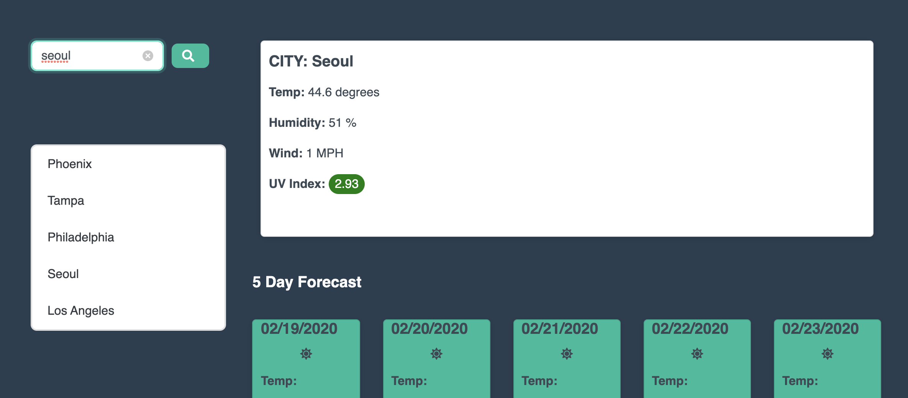

## Server Side Weather API

Type in your city, and get a 5-day forecast

This API pulls data directly from Open Weather, and comes complete with UV Index readings, Weather Forecasts, and even a search history for your convenience.

## Links
[***CLICK HERE FOR THE APP***](https://waltribeiro.github.io/weather-web-api)

## Contact
If you like this app and want me to build one for you, then contact me at w@waltrib.com

I have other apps over at my [Github](http://waltrib.com)

## Screenshot
